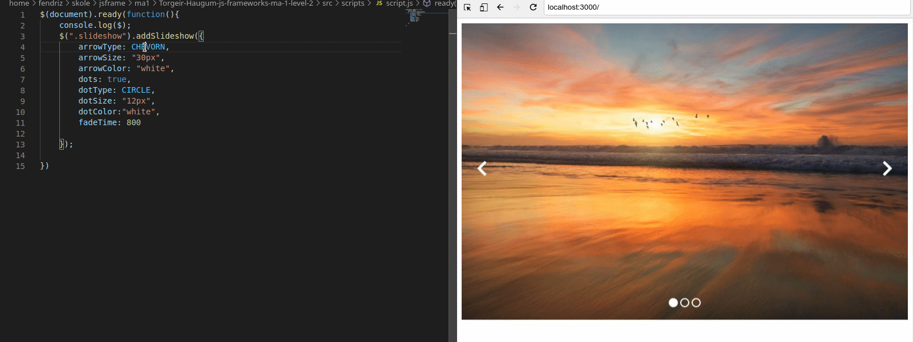

## SimpleSliderTH

SimpleSliderTH is a simple and lightweight jQuery Slider plugin which enables you to costomize the look of the slider. You can Fast and easy change size,colors and arrowtypes for the slider. 

#### Feadtures:

* 4 different arrowsets for sliding through images. 
   
* change between circled and squered highlight "dots"
 
* Change colors and size of icons.
* Change fade-inn delay for the images.

#### Basic Usage:

1.  Load the `simpleSlider.css` in the document head section together with a link to fontawsome.
    ```html 
    <link rel="stylesheet" href="https://use.fontawesome.com/releases/v5.5.0/css/all.css" integrity="sha384-B4dIYHKNBt8Bc12p+WXckhzcICo0wtJAoU8YZTY5qE0Id1GSseTk6S+L3BlXeVIU" crossorigin="anonymous">    
    <link rel="stylesheet" type="text/css" href="simpleSliderTH.css">
    ```

2.  Add a group of images to the slider as follows. 
    **Note!** Use the same classname as described bellow or else the css and js will not work properly.
    ```html
    <div class="slideshow">
        <div class="slideshow-slides">
            
        </div>
        <div class="slideshow-slides">
            
        </div>
        <div class="slideshow-slides">
            
        </div>    
    </div> 
    
3.  Load the `simpleSliderTH.js` or the`simpleSliderTH.min.js ` together with the jQuery library.
    ```html
    <script src="https://ajax.googleapis.com/ajax/libs/jquery/1.11.3/jquery.min.js"></script>
    <script src="simpleSliderTH.min.js"></script>
    ```
4. Create your own script file and add the slider to slideshow class
    ```javascript
    $(document).ready(function(){
        $(".slideshow").addSlideshow({       
        });
    })

5.  These are the following settings that are costomizable.
    If you keep the object empty these will also be de predefined settings:
    ```javascript
    $(document).ready(function(){
        $(".slideshow").addSlideshow({
            arrowType: CHEVORN,
            arrowSize: "30px",
            arrowColor: "white",
            dots: true,
            dotType: CIRCLE,
            dotSize: "12px",
            dotColor:"white",
            fadeTime: 800
        
        });
    })
    ```
    `arrowType:` `CHEVORN` , `CHEVORN_CIRCLE`, `CARET` , `CARET_SQUARE` 
    `dotType:` `CIRCLE` , `SQUARE` 

    `colors:` For the colors you can use normal css notation with hex or colorcode. I have also made a predefined colorset with light colors:
    ```javascript
    const RED = "#F1C3B3";
    const YELLOW ="#EFF1B3";
    const GREEN ="#B8F1B3";
    const CYAN ="#B3F1F1";
    const BLUE ="#B3BBF1";
    const PURPLE ="#D4B3F1";
    const PINK = "F1B3DB";
    ```
    `sizes:` Use sizes in pixels as seen in the predefined settings.
    `fadeTime`  This is the time in milliseconds. Fadeing from 0.5 opacity -> 1.
    <br>

       

